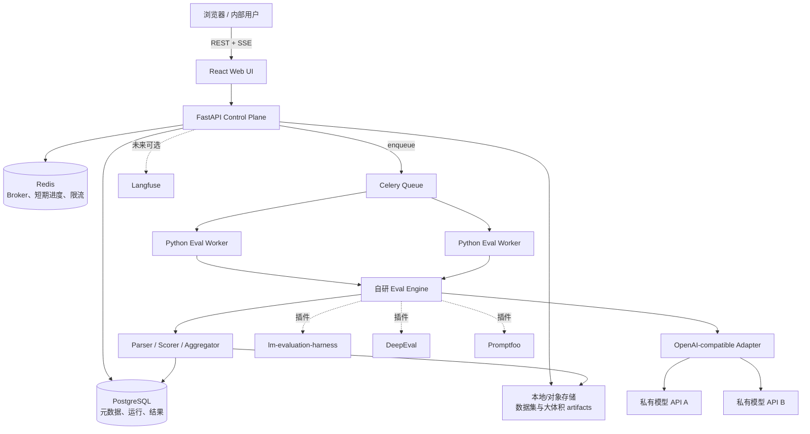
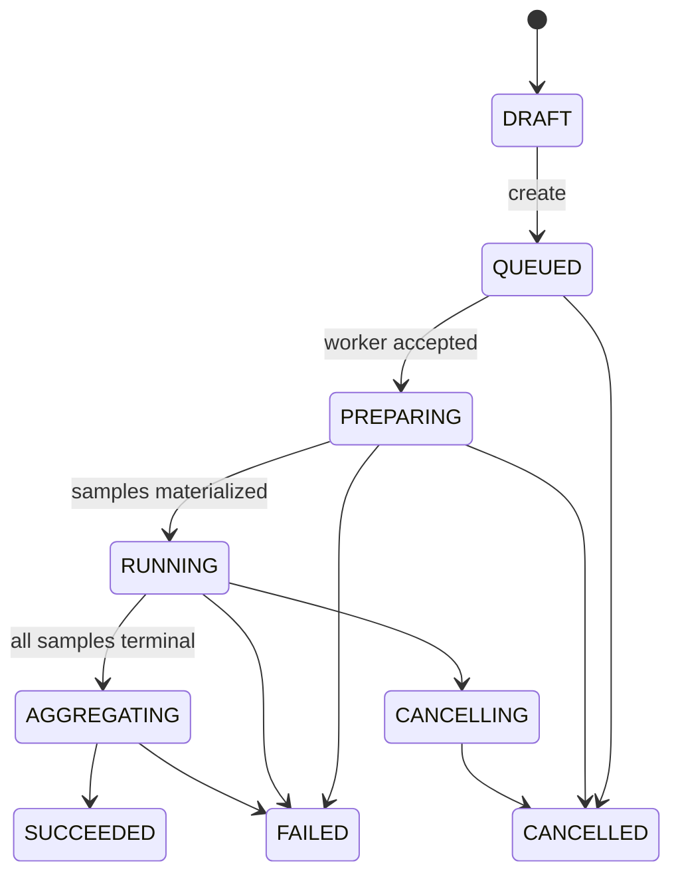

# 私有化部署 LLM 自动化测评平台项目计划

> 文档状态：可用于立项、架构评审与 MVP 开发拆解  
> 建议项目代号：`LLM Eval Hub`  
> 版本：v0.1  
> 更新日期：2026-08-13

## 0. 实施状态（持续更新）

> 开始实施：2026-08-11  
> 当前阶段：Phase 1 / P1-01 至 P1-13 全部通过，进入退出门审计
> 工作目录：`/home/zihaomu/bigssd_workspace/model_benchmark`（与 `/dc2/zihaomu/workspace/model_benchmark` 为同一目录）

### 0.1 当前进度

- [x] 读取并确认项目计划、MVP 范围和首个 vertical slice。
- [x] 初始化 Git 仓库和推荐目录结构。
- [x] 建立 Python 3.12、React、Docker Compose 基础配置。
- [x] 固定 Hugging Face 缓存到项目内 `hf_cache/`，禁止落到用户级默认缓存。
- [x] Compose 项目、容器和持久卷统一使用 `zihao` 归属前缀。
- [x] GPU 资源限制为本机后两张 AMD 卡（物理卡 `2,3`），CPU-only 服务不挂载 GPU 设备。
- [x] 完成 dataset schema、fingerprint、parser/scorer/aggregator 与 golden tests。
- [x] 完成 FastAPI、16 张 PostgreSQL 核心表、Alembic、Endpoint/Dataset/Run API。
- [x] 完成 Celery worker、OpenAI adapter、mock server 与异步评测链路。
- [x] 完成 React 核心页面、SSE 进度、结果、分组指标与失败样本页面。
- [x] 完成 transient failure 定向重试、attempt 保留和断点幂等跳过。
- [x] 完成 Compose 构建启动和 12 样本首个 vertical slice 端到端验收。
- [x] 将 Phase 1/2 细化为可执行的 MVP、Benchmark 与回归能力实验计划。
- [x] 完成容量、共享 QPS、故障重试、取消、worker crash 和 PostgreSQL 双次恢复实验。
- [x] 完成 Chromium 桌面/移动 Browser E2E、SSE 刷新恢复、筛选和 CSV/JSONL 导出验收。
- [x] 完成 endpoint secret/API/数据库/Celery/Redis/log 扫描及 SSRF 拒绝矩阵，P1-01 至 P1-13 全部通过。
- [ ] 完成第 18 节验收项到实验 ID 的逐条映射、操作手册评审与 `mvp-v1.0.0` 冻结。

### 0.2 原型阶段临时决策

以下决策均通过环境变量或服务边界保留替换能力，不阻塞 vertical slice：

1. 鉴权先使用单个内部管理员 Bearer/API Key，企业 OIDC 留作后续接入。
2. API Key 使用 Fernet 主密钥加密；主密钥仅通过环境变量注入，不写数据库。
3. Endpoint 默认只允许配置的私网 CIDR 和域名；开发环境显式允许 mock 服务与 `host.docker.internal`。
4. 默认 endpoint 并发为 8、QPS 为 10，全局并发上限为 32。
5. 前端/API/Mock 宿主端口分别为 `18080`、`18000`、`18001`，避免占用机器现有服务端口。
6. 本机 GPU 只允许使用物理卡 `2,3`；统一设置 ROCm/HIP/CUDA 可见设备变量，物理卡 `0,1` 禁止使用。

### 0.3 实施日志

| 时间 | 变更 | 验证 |
|---|---|---|
| 2026-08-11 | 初始化代码仓库、目录、依赖与 Compose；增加项目内 HF 缓存约束 | Compose 配置解析通过；所有容器、项目和卷名称含 `zihao` |
| 2026-08-11 | 实现 `eval-dataset/v1`、checksum 校验、受限 Jinja 渲染、稳定 fingerprint、内置 parser/scorer/F1/latency 聚合和 12 条 golden dataset | golden checksum: `2988edfefa2c1fbfb4c532685811f608cd7ffcea5d6ef94cbb5a8e181c4ff1d8` |
| 2026-08-11 | 实现 FastAPI、SQLAlchemy/Alembic、Fernet 密钥加密、SSRF allowlist、审计、Endpoint/Dataset/Run API | API `/healthz`、endpoint probe、模型发现、数据集上传/预览和 run validate 均通过容器实测 |
| 2026-08-11 | 实现 Celery native worker、并发/QPS、HTTP 重试与错误分类、逐样本事实、聚合/分组指标、取消检查和 transient failure 定向重试 | 重试目标样本 attempt `1 -> 2`，其余样本未重跑；恢复后 run `SUCCEEDED` |
| 2026-08-11 | 实现 React/Vite 控制台：Dashboard、Endpoints、Datasets、四步测评向导、Runs、Run Detail、SSE、筛选和 CSV/JSONL 导出 | `eslint`: passed；production build: passed；`npm audit --omit=dev`: 0 vulnerabilities |
| 2026-08-11 | 在 Compose 内使用 mock OpenAI 完成 12 样本 E2E | 12/12 完成；accuracy/macro/micro F1 = `1.0`；API/parse error = `0`；分组指标落库；CSV 13 行 |
| 2026-08-11 | 完成当前自动化回归 | `pytest`: 31 passed；`ruff`: passed |
| 2026-08-11 | 细化 Phase 1/2 的实验矩阵、Benchmark 能力边界、paired regression、quality gate 和退出门 | 见 [`MVP_Benchmark_Regression_Experiment_Plan.md`](./MVP_Benchmark_Regression_Experiment_Plan.md) |
| 2026-08-12 | 完成 P1-01 至 P1-11，加入后两卡资源硬约束 | 容量/QPS/故障/取消/worker crash/备份恢复通过；API/worker 仅暴露 GPU `2,3`，P1-11 未挂载 GPU 设备 |
| 2026-08-12 | 完成 P1-11 后全量回归 | unit/contract `50 passed`；integration `6 passed`；Ruff、ESLint、Vite build 和主 Compose 健康检查通过 |
| 2026-08-12 | 完成 P1-12 Browser E2E 与真实 Endpoint 接入 | Chromium 桌面/移动主流程、SSE 恢复、结果/筛选/导出通过；登记时可填写 Model ID，无 `/models` 时可继续；公网 Endpoint 仅允许精确域名 |
| 2026-08-12 | 注册 Native Benchmark 基础数据包 | GSM8K `1,319`、MMLU Lite `570`、MMLU Full `14,042`；固定上游 revision/checksum，主库幂等注册和前端选择通过 |
| 2026-08-13 | 完成 P1-13 Secret/SSRF | 13 项安全断言 PASS；完整 secret 在 API/DB/Celery/Redis/log/evidence 中 0 命中；loopback/metadata/越权域名和敏感认证 header 稳定拒绝；69 unit/contract、6 integration、Browser E2E 2 passed |

### 0.4 当前运行入口

- Web：`http://localhost:18080`
- API：`http://localhost:18000`；OpenAPI：`http://localhost:18000/docs`
- Mock OpenAI：`http://localhost:18001/v1`
- 开发环境 API Key：见 `.env`/`.env.example` 的 `ADMIN_API_KEY`；不得用于生产。
- 启停命令：`docker compose up -d --build` / `docker compose down`。

### 0.5 Phase 1 剩余工作

1. 将第 18 节全部验收项逐条映射到 P1 实验 ID，并完成操作手册和默认资源上限评审。
2. 从干净环境复核 Compose 启动，冻结 migration head、镜像 digest、golden checksum 并创建 `mvp-v1.0.0` tag。
3. 完成数据保留清理和生产 Vault/KMS/egress firewall 接入；OIDC/RBAC 按 Phase 2 计划实施。
4. 前端生产包中 ECharts 主 chunk 约 1.46 MB（gzip 约 484 KB），功能不受影响，后续应按路由和图表模块拆包。

## 1. 项目背景

团队维护了多套私有化部署的大语言模型服务，这些服务大多暴露 OpenAI-compatible API，但当前缺少统一、可复现、可对比的质量测评入口。模型上线、版本升级、量化方式变化、推理参数调整后，通常需要人工运行脚本、整理结果，难以持续回答以下问题：

- 某个 API 在指定数据集上的 accuracy、F1、exact match 是多少？
- 相同模型不同版本、不同推理后端或不同参数之间是否发生质量回退？
- 失败发生在模型回答错误、输出格式异常，还是网络、限流、超时等 API 错误？
- 测试协议是否一致，结果是否真正可横向比较？
- 哪些失败样本最值得分析，是否能一键导出并形成回归集？

本项目建设一个部署在专用测评机器上的内部平台。用户只需登记 API、选择模型与数据集、设置并发及推理参数，即可异步执行评测，并查看聚合指标、延迟分布、错误分类与失败样本。

核心策略是：**平台自研统一的 Eval Engine、数据模型、任务编排与 UI；开源项目以插件形式接入，而不是成为平台的控制面。** 这样可以保证协议、审计、任务状态和结果格式由平台掌控，同时复用成熟的 benchmark 与评分能力。

## 2. 项目目标与非目标

### 2.1 目标

1. 支持登记和连通性检测 OpenAI-compatible endpoint。
2. 支持从 `/v1/models` 发现模型，也支持用户手工填写模型 ID。
3. 支持选择一个或多个版本化数据集创建评测任务。
4. 支持设置并发、超时、重试、temperature、max tokens、seed 等参数。
5. 支持 classification accuracy、macro/micro F1、exact match、数值匹配及可插拔自定义评分器。
6. 输出吞吐、P50/P95/P99 latency、API error rate、解析错误率、失败样本及原始请求/响应。
7. 支持任务异步执行、进度查看、取消、断点恢复与失败重试。
8. 保存完整的评测协议、数据集版本、模型参数及平台版本，确保结果可复现、可审计、可比较。
9. 支持 CSV/JSONL 导出，后续支持模型间对比和持续回归。
10. 单机 Docker Compose 可部署，组件边界允许未来横向扩容 worker。

### 2.2 非目标

MVP 阶段不包含：

- 模型训练、微调、量化或推理服务部署。
- GPU 资源调度和模型生命周期管理。
- 完整的生产流量观测平台；Langfuse 仅作为未来可选集成。
- 通用标注平台或复杂的人类偏好评测平台。
- 自动下载并无条件重新分发受许可证限制的数据集。
- 把不同 scoring protocol 得到的同名指标直接进行排行榜比较。
- 以单次运行结果代替统计显著性分析或人工错误分析。

## 3. 关键设计原则

1. **协议优先**：每次运行必须固定 `dataset_version`、`protocol_id`、prompt template、few-shot、采样参数、解析器和评分器版本。
2. **原始事实不可变**：原始请求、响应、计时和错误记录只追加，不被后处理覆盖；重新评分生成新的 score revision。
3. **生成与评分解耦**：先完成 inference record，再由 scorer 计算 sample score，便于离线重算指标。
4. **可比性显式判断**：只有协议指纹一致的运行才默认允许横向比较。
5. **凭据最小暴露**：API Key 加密保存、只在 worker 内解密、任何日志和前端响应均脱敏。
6. **幂等与可恢复**：任务和样本具备稳定 ID；worker 重启后可重试未完成样本，不重复计数。
7. **自研核心、插件复用**：原生引擎覆盖主要在线 API 测评；lm-evaluation-harness、DeepEval、Promptfoo 通过 adapter 接入。

## 4. 用户流程


标准操作路径：

1. 用户在“模型与 Endpoint”页面填写 base URL、认证方式及可选 API Key。
2. 平台调用 `/v1/models` 和一条最小 chat 请求进行探测，记录兼容能力。
3. 用户进入“新建评测”，选择 endpoint、model、一个或多个 dataset version。
4. 平台根据数据集声明展示允许的 scoring protocol；不兼容的组合被禁用并解释原因。
5. 用户设置并发、QPS、超时、重试及推理参数，执行预检。
6. 后端冻结本次运行配置，生成 protocol fingerprint 和样本任务。
7. worker 并发调用模型，实时上报进度；UI 通过 SSE 展示运行状态。
8. 完成后展示总体和分组指标、延迟、错误率、失败样本；用户可筛选与导出。

## 5. 总体架构



### 5.1 组件职责

| 组件 | 职责 | MVP 技术建议 |
|---|---|---|
| React Web UI | 配置、进度、结果与失败样本浏览 | React + TypeScript + Vite，TanStack Query，ECharts |
| FastAPI | 身份校验、配置管理、任务创建、查询、SSE | Python 3.12、FastAPI、Pydantic、SQLAlchemy、Alembic |
| PostgreSQL | 权威状态、配置快照、逐样本结果和聚合指标 | PostgreSQL 16+ |
| Redis | Celery broker、分布式限流、短期进度缓存 | Redis 7+；不作为最终结果的唯一存储 |
| Celery | 长任务调度、重试、取消信号和队列隔离 | Celery 5.x |
| Eval Worker | 数据装载、渲染、调用、解析、评分、聚合 | Python、HTTPX async、插件 adapters |
| Artifact Store | 数据集、导出文件、超大响应等 | MVP 本地 volume；后续 S3/MinIO |

## 6. 核心模块

### 6.1 Endpoint Registry

- 保存 endpoint 名称、base URL、认证方式、TLS 设置、默认 headers。
- API Key 使用 envelope encryption；数据库只保存密文和 key reference。
- 能力探测：models list、chat completions、legacy completions、stream、seed、logprobs、response format、usage 字段。
- 探测结果是“观察值”而不是永久能力声明，可重新检测。
- SSRF 防护：仅允许配置的私网 CIDR/域名白名单，禁止 loopback、metadata 地址和重定向到未授权网段；部署环境需要访问本机模型时显式白名单。

### 6.2 Dataset Registry

- Dataset 与 DatasetVersion 分离，已被运行引用的版本不可变。
- 支持 JSONL、CSV、Parquet；MVP 以 JSONL 为主。
- 导入时校验 schema、唯一 sample ID、标签集合、缺失值及文件 checksum。
- 保存 dataset license、source、language、split、tags、敏感级别。
- 大文件进入 artifact store，PostgreSQL 保存 manifest 与 URI。

### 6.3 Prompt Renderer

- 使用受限 Jinja2 模板生成 `messages` 或 `prompt`。
- 支持 system prompt、few-shot 固定样例、选项随机化（必须记录 seed）和字段映射。
- 渲染结果随每个 inference sample 保存，避免模板变更破坏审计。
- 模板禁止任意 Python 执行和不受控文件读取。

### 6.4 OpenAI Adapter

- 将规范化请求映射到 `/v1/chat/completions` 或 `/v1/completions`。
- 统一处理认证、headers、timeout、retry、429、5xx、stream、usage 与供应商扩展字段。
- 记录 TTFT（仅流式时）、端到端 latency、HTTP 状态、模型返回 ID 和 token usage。
- 使用确定性的错误分类，避免将 API 错误计为模型答错。

### 6.5 Response Parser

- 解析器是数据集协议的一部分，例如 `choice_letter_v1`、`json_path_v1`、`numeric_v1`。
- 解析输出包含 normalized prediction、parse status、evidence/span 和 parser version。
- 解析失败单独统计 `parse_error_rate`，默认不与 transport error 混合。

### 6.6 Scorer 与 Aggregator

- 逐样本 scorer：exact match、normalized exact match、classification、token/span F1、numeric tolerance、regex、JSON schema、自定义 Python 插件。
- 聚合器：accuracy、macro/micro/weighted F1、exact match rate、分组指标、bootstrap confidence interval（Phase 2）。
- latency 只对成功收到有效 HTTP 响应的请求统计；另给出全请求 latency，二者字段名必须不同。
- 默认主指标的分母由协议定义，并同时展示：总样本数、已尝试、有效回答、评分成功、API 错误、解析错误。

### 6.7 Plugin Adapters

| 适配器 | 用途 | 边界 |
|---|---|---|
| Native | 在线 OpenAI-compatible API 的主要路径 | MVP 首选，平台完全掌控记录格式 |
| lm-evaluation-harness | 复用标准 benchmark、few-shot/task YAML、loglikelihood 任务 | 必须保存 harness 版本、task commit、model adapter 和命令参数 |
| DeepEval | 语义质量、RAG、LLM-as-judge、自定义指标 | Judge model 与 prompt 必须固定；MVP 不作为基础 accuracy 的依赖 |
| Promptfoo | Prompt/Provider 回归、assertion 生态 | 作为外部 runner 或 config adapter，不成为权威任务数据库 |
| Langfuse | 未来的 trace/观测与线上样本回流 | 可选；不能向外部 SaaS 发送私有数据，除非明确批准 |

## 7. Eval Engine 接口设计

Eval Engine 采用六阶段 pipeline：`load -> render -> infer -> parse -> score -> aggregate`。各阶段通过结构化对象交接，便于替换实现与单元测试。

### 7.1 核心 Python Protocol

```python
from dataclasses import dataclass
from typing import Any, AsyncIterator, Mapping, Protocol, Sequence

@dataclass(frozen=True)
class EvalSample:
    sample_id: str
    inputs: Mapping[str, Any]
    reference: Any
    metadata: Mapping[str, Any]

@dataclass(frozen=True)
class ModelRequest:
    request_id: str
    model: str
    mode: str                    # chat_completions | completions
    messages: list[dict] | None
    prompt: str | None
    params: Mapping[str, Any]

@dataclass(frozen=True)
class InferenceResult:
    request_id: str
    raw_response: Mapping[str, Any] | None
    output_text: str | None
    latency_ms: float
    ttft_ms: float | None
    prompt_tokens: int | None
    completion_tokens: int | None
    error_type: str | None
    error_message_redacted: str | None

@dataclass(frozen=True)
class ParsedAnswer:
    value: Any
    status: str                  # ok | no_match | invalid_format
    parser_version: str
    evidence: Mapping[str, Any]

@dataclass(frozen=True)
class SampleScore:
    primary: float | None
    metrics: Mapping[str, float]
    passed: bool | None
    reason: str | None
    scorer_version: str

class DatasetLoader(Protocol):
    def iter_samples(self) -> Sequence[EvalSample]: ...

class PromptRenderer(Protocol):
    def render(self, sample: EvalSample) -> ModelRequest: ...

class ModelAdapter(Protocol):
    async def infer(self, request: ModelRequest) -> InferenceResult: ...

class ResponseParser(Protocol):
    def parse(self, sample: EvalSample, result: InferenceResult) -> ParsedAnswer: ...

class Scorer(Protocol):
    def score(self, sample: EvalSample, answer: ParsedAnswer) -> SampleScore: ...

class Aggregator(Protocol):
    def aggregate(self, scores: Sequence[SampleScore]) -> Mapping[str, Any]: ...

class EvalRunner(Protocol):
    async def run(self, spec: "FrozenRunSpec") -> AsyncIterator[dict]: ...
```

### 7.2 冻结运行配置

创建任务时生成 `FrozenRunSpec`，不得引用可变的“当前配置”。至少包含：

- endpoint revision ID、model ID、API capability snapshot；
- dataset version ID、文件 SHA-256、sample selection/filter；
- protocol ID/version、prompt template content/hash、few-shot IDs/order；
- parser/scorer/aggregator ID 与版本；
- temperature、top_p、max_tokens、seed、stop、response_format；
- timeout、retry policy、concurrency、QPS；
- engine Git commit、container image digest、依赖 lock hash；
- 创建者、创建时间、运行目的和可选基线 run ID。

以上字段进行 canonical JSON 序列化并计算 `protocol_fingerprint`。比较页面默认只比较 fingerprint 一致的运行；若用户强制跨协议比较，UI 显示明显警告。

### 7.3 错误分类

```text
transport.dns | transport.connect | transport.tls | transport.timeout
http.401 | http.403 | http.404 | http.429 | http.5xx | http.other
response.invalid_json | response.schema_mismatch | response.empty
parser.no_match | parser.invalid_format
scorer.error | dataset.invalid_sample | internal.worker_error
cancelled
```

重试只适用于明确的瞬时错误，如 connect reset、timeout、429、部分 5xx；401、403、404、确定性 schema 错误不自动重试。每次 attempt 单独记录，但样本最终只聚合一次。

## 8. Dataset YAML 规范

每个 dataset version 由一份不可变 manifest 和数据文件组成。建议 schema 版本从 `eval-dataset/v1` 开始。

```yaml
api_version: eval-dataset/v1
kind: Dataset
metadata:
  name: internal-support-intent
  display_name: Internal Support Intent
  version: "2026.08.1"
  description: 内部客服意图分类测试集
  language: [zh-CN]
  license: proprietary
  owner: ai-platform
  tags: [classification, internal]

data:
  format: jsonl
  path: data/test.jsonl
  split: test
  checksum_sha256: "<64-hex>"
  id_field: id
  input_fields: [question]
  reference_field: label
  metadata_fields: [category, difficulty]

request:
  mode: chat_completions
  messages:
    - role: system
      content: >-
        你是分类器。只能输出 billing、technical、account 之一。
    - role: user
      content: "{{ question }}"
  parameters:
    temperature: 0
    max_tokens: 8
    seed: 42
  stop: []

protocol:
  id: intent-chat-greedy-v1
  task_type: single_label_classification
  prediction_source: generated_text
  few_shot:
    count: 0
    selection: fixed
    sample_ids: []
  parser:
    type: label_set
    version: "1"
    labels: [billing, technical, account]
    normalize: [trim, unicode_nfkc, lowercase]
  scorer:
    type: classification
    version: "1"
    primary_metric: accuracy
    metrics: [accuracy, macro_f1, micro_f1]
  denominator_policy: all_scoring_samples
  on_api_error: exclude_and_report
  on_parse_error: count_as_incorrect

groups:
  - field: category
  - field: difficulty

validation:
  required_fields: [id, question, label]
  unique_by: [id]
  allowed_values:
    label: [billing, technical, account]
```

示例 `data/test.jsonl`：

```json
{"id":"s-0001","question":"为什么信用卡被扣了两次？","label":"billing","category":"payment","difficulty":"easy"}
{"id":"s-0002","question":"登录后一直显示 502。","label":"technical","category":"login","difficulty":"medium"}
```

### 8.1 多选题协议扩展

多选题必须显式声明预测来源，不能仅写 `task_type: multiple_choice`：

```yaml
protocol:
  id: mmlu-chat-letter-0shot-v1
  task_type: multiple_choice
  prediction_source: generated_text   # 或 choice_loglikelihood
  parser:
    type: choice_letter
    allowed: [A, B, C, D]
  scorer:
    type: exact_choice
    primary_metric: accuracy
```

若为 `choice_loglikelihood`，endpoint capability 必须提供可满足协议的 completion logprobs/loglikelihood；若仅支持 chat-completions 生成文本，则只能运行 `generated_text` 协议，两者必须使用不同的 protocol ID 和排行榜分组。

## 9. OpenAI-compatible Endpoint 适配

### 9.1 用户输入

- `base_url`：推荐输入到 `/v1`，平台规范化路径并防止重复拼接。
- `auth_type`：`bearer`、`api-key-header`、`none`、未来可扩展 mTLS。
- `api_key`：可选，写入后只显示末四位或“已配置”。
- `extra_headers`：只允许管理员配置，并过滤 `Host`、`Content-Length` 等危险 header。
- `model_id`：优先从 `/v1/models` 获取；失败时允许手填。

### 9.2 探测顺序

1. URL 与网络策略校验。
2. `GET /v1/models`，解析模型 ID；失败不直接判定 endpoint 不可用。
3. `POST /v1/chat/completions` 最小非流式请求。
4. 根据需要探测 stream、seed、logprobs、JSON response format。
5. 保存 capability snapshot、响应时间与脱敏后的失败原因。

### 9.3 规范化请求示例

```json
{
  "model": "qwen-private-v3",
  "messages": [{"role": "user", "content": "仅回答 OK"}],
  "temperature": 0,
  "max_tokens": 4,
  "stream": false,
  "seed": 42
}
```

兼容性注意事项：

- 不假设所有服务都支持 `seed`、`response_format`、`logprobs`、`system` role 或 usage 字段。
- OpenAI-compatible 表示请求/响应大体兼容，不代表 tokenizer、chat template、停止条件、logprob 语义和错误码完全一致。
- endpoint 返回的 `model` 字段与请求值不一致时记录警告。
- 重定向默认禁止；如允许，目标必须再次通过网络策略校验。
- 连接池按 endpoint 隔离；认证头不得跨 endpoint 复用。
- 默认不启用 stream；需要 TTFT 时另建 performance run，避免改变质量测评路径。

## 10. 任务调度、并发与恢复

### 10.1 状态机



`SUCCEEDED` 允许存在样本级 API 错误；任务级 `FAILED` 只用于无法继续的系统性错误，例如数据集损坏、凭据无效且所有请求必然失败、worker 内部异常或聚合失败。结果页面需显示 `completed_with_errors` 派生状态。

### 10.2 任务粒度

- `run`：用户可见的一次运行。
- `run_dataset`：一个 run 中的一个数据集版本。
- `sample_execution`：最小幂等执行单元。
- Celery 不建议为几十万样本一次性创建同等数量的 broker 消息；MVP 使用固定大小 shard，例如每 shard 20–100 个样本，并在 shard 内异步并发。

### 10.3 并发控制

有效并发由以下限制共同决定：

```text
effective_concurrency = min(
  run_requested_concurrency,
  endpoint_concurrency_limit,
  worker_capacity,
  global_safety_limit
)
```

- 每 endpoint 使用 Redis semaphore 和 token-bucket QPS limiter。
- 支持用户设置 concurrency 与 QPS；默认值偏保守，例如 concurrency=8。
- 遇到 429 时尊重 `Retry-After`，采用带 jitter 的指数退避，并临时降低 endpoint 并发。
- 一个 run 的 shard 使用公平队列，避免大任务长期占满 worker。
- 可按 `native`、`harness`、`judge` 建独立 Celery queue，防止高资源插件阻塞普通评测。

### 10.4 幂等与断点恢复

- `sample_execution` 唯一键：`(run_dataset_id, sample_id)`。
- attempt 使用单独表；最终成功通过事务更新 sample terminal state。
- worker ack-late；处理前检查数据库状态，已 terminal 的样本直接跳过。
- 进度以 PostgreSQL 为权威，Redis 只做加速和事件推送。
- 取消采用数据库标志 + Celery revoke 协作；正在执行的 HTTP 请求在安全点终止。
- 任务重跑默认创建新 run；只允许对当前 run 的 transient failures 执行“重试失败样本”。

## 11. 数据库表设计

推荐使用 UUIDv7/ULID 作为主键，时间统一存 UTC。API 返回 ISO 8601。

| 表 | 关键字段 | 说明与索引 |
|---|---|---|
| `users` | id, username, role, created_at | MVP 可接企业 SSO，也可先用本地管理员 |
| `endpoints` | id, name, base_url, auth_type, secret_ref, owner_id, status | base_url 不含密钥；按 owner/status 索引 |
| `endpoint_revisions` | id, endpoint_id, config_json, config_hash, created_at | 每次配置变化创建 revision |
| `endpoint_capabilities` | revision_id, checked_at, capabilities_json, probe_status | 保存探测快照 |
| `models` | id, endpoint_id, model_name, display_name, enabled | 唯一键 `(endpoint_id, model_name)` |
| `datasets` | id, name, display_name, owner_id, sensitivity | name 唯一 |
| `dataset_versions` | id, dataset_id, version, manifest_json, data_uri, checksum, row_count | 唯一键 `(dataset_id, version)`；已使用后不可改 |
| `protocols` | id, name, version, spec_json, spec_hash | 协议定义可复用，也可由 manifest 内嵌冻结 |
| `runs` | id, name, status, created_by, model_id, endpoint_revision_id, run_spec_json, protocol_fingerprint, baseline_run_id, timestamps | 索引 status、created_by、created_at、fingerprint |
| `run_datasets` | id, run_id, dataset_version_id, protocol_id, status, counters_json | 唯一键 `(run_id, dataset_version_id)` |
| `sample_executions` | id, run_dataset_id, sample_id, rendered_request_json, raw_response_uri/json, output_text, parsed_value_json, status, latency_ms, token counts, error fields | 唯一键 `(run_dataset_id, sample_id)`；按 status/error_type 索引 |
| `request_attempts` | id, sample_execution_id, attempt_no, started_at, duration_ms, http_status, error_type, response_excerpt_redacted | 唯一键 `(sample_execution_id, attempt_no)` |
| `sample_scores` | id, sample_execution_id, score_revision, scorer_id/version, primary_score, metrics_json, passed, reason | 允许重新评分；唯一键含 revision |
| `run_metrics` | id, run_dataset_id, metric_name, value, denominator, group_key, group_value, score_revision | 按 run_dataset/metric/group 索引 |
| `artifacts` | id, run_id, kind, uri, checksum, size_bytes, retention_until | 导出、日志、原始大响应 |
| `audit_logs` | id, actor_id, action, resource_type/id, metadata_json, created_at | 不保存明文密钥 |

### 11.1 数据保留建议

- 配置快照、聚合指标：长期保留。
- 失败样本与脱敏请求/响应：默认 180 天，按敏感级别调整。
- 成功样本的完整原始响应：默认 30–90 天；之后可保留 output、score 与 checksum。
- API Key：密文保存，支持轮换；删除 endpoint 时撤销或删除 secret。

## 12. 后端 API 草案

所有接口前缀 `/api/v1`，错误使用统一结构：

```json
{
  "error": {
    "code": "ENDPOINT_PROBE_FAILED",
    "message": "无法连接模型服务",
    "details": {"category": "transport.timeout"},
    "request_id": "req_..."
  }
}
```

### 12.1 Endpoint 与模型

| 方法 | 路径 | 用途 |
|---|---|---|
| POST | `/endpoints` | 新建 endpoint；密钥只写不回显 |
| GET | `/endpoints` | 列表与状态 |
| GET | `/endpoints/{id}` | 详情与脱敏配置 |
| PATCH | `/endpoints/{id}` | 创建新 revision |
| POST | `/endpoints/{id}/probe` | 异步能力与连通性探测 |
| GET | `/endpoints/{id}/models` | 列出已发现/手工配置模型 |
| POST | `/endpoints/{id}/models` | 添加手工 model ID |

### 12.2 数据集

| 方法 | 路径 | 用途 |
|---|---|---|
| POST | `/datasets` | 新建 dataset 元数据 |
| GET | `/datasets` | 搜索、标签和敏感级别过滤 |
| POST | `/datasets/{id}/versions` | 上传 manifest + 文件并校验 |
| GET | `/datasets/{id}/versions/{version}` | 查看冻结 manifest 与统计 |
| POST | `/datasets/validate` | 只验证，不入库 |
| GET | `/datasets/{id}/versions/{version}/preview` | 脱敏分页预览 |

### 12.3 运行与结果

| 方法 | 路径 | 用途 |
|---|---|---|
| POST | `/runs/validate` | 校验 endpoint/model/dataset/protocol 兼容性，估算样本数 |
| POST | `/runs` | 创建并入队；支持 `Idempotency-Key` |
| GET | `/runs` | 列表和筛选 |
| GET | `/runs/{id}` | 状态、冻结配置与总体进度 |
| GET | `/runs/{id}/events` | SSE 进度事件 |
| POST | `/runs/{id}/cancel` | 请求取消 |
| POST | `/runs/{id}/retry-failures` | 仅重试瞬时失败样本 |
| GET | `/runs/{id}/metrics` | 总体与分组指标 |
| GET | `/runs/{id}/samples` | 分页查询成功/错误/低分/标签 |
| GET | `/runs/{id}/samples/{sample_execution_id}` | 请求、响应、解析和评分详情 |
| POST | `/runs/{id}/rescore` | 使用新 scorer revision 离线重评分 |
| POST | `/runs/compare` | 仅默认比较可兼容 runs |
| POST | `/runs/{id}/exports` | 生成 CSV/JSONL 报告 |
| GET | `/exports/{id}/download` | 权限校验后下载 |

### 12.4 创建运行示例

```json
{
  "name": "qwen-v3-regression-20260811",
  "endpoint_id": "ep_01...",
  "model_id": "model_01...",
  "datasets": [
    {"dataset_version_id": "dsv_01...", "protocol_id": "mmlu-chat-letter-0shot-v1"},
    {"dataset_version_id": "dsv_02...", "protocol_id": "intent-chat-greedy-v1"}
  ],
  "inference": {
    "temperature": 0,
    "max_tokens": 32,
    "seed": 42
  },
  "execution": {
    "concurrency": 16,
    "qps": 20,
    "timeout_seconds": 60,
    "max_retries": 2
  }
}
```

返回 `202 Accepted`，包含 run ID、已冻结的 protocol fingerprint 和状态 URL。

## 13. 前端页面

### 13.1 页面清单

1. **Dashboard**：近期运行、成功率、质量回退、失败任务、endpoint 健康状态。
2. **Endpoints**：创建、编辑、探测、模型发现、能力矩阵与密钥轮换。
3. **Datasets**：列表、版本、YAML/数据上传、校验错误、样本预览。
4. **New Evaluation**：四步向导——模型、数据集/协议、参数、预检确认。
5. **Runs**：状态、创建者、模型、数据集、时间和 fingerprint 过滤。
6. **Run Detail / Overview**：主指标卡片、样本分母、进度、latency/error 图表、协议摘要。
7. **Run Detail / Samples**：按错误类型、是否通过、标签、分组过滤；查看单样本详情。
8. **Compare**：相同 fingerprint 下展示指标差异、paired wins/losses、回退样本。
9. **Settings / Audit**：系统限制、保留策略、角色权限、审计日志。

### 13.2 结果页最低信息

- 主指标及其分母，例如 `accuracy 82.4% (824/1000)`。
- macro/micro F1、exact match 等适用指标；不适用指标显示“未配置”，不得以 0 代替。
- 请求总数、API 错误数/率、解析错误数/率、评分成功数。
- P50/P95/P99、平均 latency、吞吐，以及统计口径。
- endpoint、模型 ID、数据集版本、protocol ID、fingerprint、推理参数。
- 失败样本表：reference、prediction、raw output、error/score reason、latency。
- 跨协议或存在不确定配置时显示不可忽略的可比性警告。

### 13.3 SSE 事件建议

```text
run.status
run.progress
run.metric_preview
run.warning
run.completed
run.failed
heartbeat
```

SSE 仅用于体验；页面刷新后必须能从 REST + PostgreSQL 恢复真实状态。

## 14. 推荐目录结构

```text
llm-eval-hub/
├─ README.md
├─ pyproject.toml
├─ uv.lock
├─ package.json
├─ docker-compose.yml
├─ .env.example
├─ Makefile
├─ apps/
│  ├─ web/
│  │  ├─ src/
│  │  │  ├─ pages/
│  │  │  ├─ components/
│  │  │  ├─ api/
│  │  │  └─ types/
│  │  └─ Dockerfile
│  └─ api/
│     ├─ app/
│     │  ├─ main.py
│     │  ├─ api/v1/
│     │  ├─ domain/
│     │  ├─ services/
│     │  ├─ db/
│     │  ├─ auth/
│     │  └─ settings.py
│     ├─ alembic/
│     └─ Dockerfile
├─ packages/
│  ├─ eval_engine/
│  │  ├─ contracts.py
│  │  ├─ runner.py
│  │  ├─ datasets/
│  │  ├─ rendering/
│  │  ├─ adapters/
│  │  │  ├─ openai_compatible.py
│  │  │  ├─ lm_harness.py
│  │  │  ├─ deepeval.py
│  │  │  └─ promptfoo.py
│  │  ├─ parsers/
│  │  ├─ scorers/
│  │  └─ aggregators/
│  └─ shared/
├─ workers/
│  ├─ celery_app.py
│  ├─ tasks/
│  └─ Dockerfile
├─ datasets/
│  ├─ examples/
│  └─ schemas/eval-dataset-v1.schema.json
├─ tests/
│  ├─ unit/
│  ├─ integration/
│  ├─ contract/
│  ├─ e2e/
│  └─ fixtures/
├─ infra/
│  ├─ nginx/
│  ├─ postgres/
│  └─ monitoring/
└─ docs/
   ├─ architecture.md
   ├─ scoring-protocols.md
   ├─ dataset-authoring.md
   └─ operations.md
```

## 15. Docker Compose 部署

MVP 采用单机 Compose；web 只访问 API，API/worker 访问 PostgreSQL、Redis 和 artifact volume。私有模型网络应通过防火墙仅向 worker 所在网段开放。

```yaml
services:
  web:
    build: ./apps/web
    ports: ["8080:80"]
    depends_on: [api]

  api:
    build:
      context: .
      dockerfile: apps/api/Dockerfile
    command: uvicorn app.main:app --host 0.0.0.0 --port 8000
    env_file: .env
    depends_on:
      postgres:
        condition: service_healthy
      redis:
        condition: service_healthy
    volumes:
      - artifacts:/var/lib/eval-hub/artifacts

  worker:
    build:
      context: .
      dockerfile: workers/Dockerfile
    command: celery -A workers.celery_app worker -Q native --concurrency=4
    env_file: .env
    depends_on: [api, postgres, redis]
    volumes:
      - artifacts:/var/lib/eval-hub/artifacts
      - datasets:/var/lib/eval-hub/datasets
    # 如需访问宿主机模型，显式配置路由/host-gateway，不开放特权模式。

  postgres:
    image: postgres:16
    environment:
      POSTGRES_DB: evalhub
      POSTGRES_USER: evalhub
      POSTGRES_PASSWORD_FILE: /run/secrets/postgres_password
    secrets: [postgres_password]
    volumes:
      - pgdata:/var/lib/postgresql/data
    healthcheck:
      test: ["CMD-SHELL", "pg_isready -U evalhub -d evalhub"]
      interval: 5s
      timeout: 3s
      retries: 20

  redis:
    image: redis:7-alpine
    command: redis-server --appendonly yes
    volumes:
      - redisdata:/data
    healthcheck:
      test: ["CMD", "redis-cli", "ping"]
      interval: 5s
      timeout: 3s
      retries: 20

secrets:
  postgres_password:
    file: ./secrets/postgres_password.txt

volumes:
  pgdata:
  redisdata:
  artifacts:
  datasets:
```

`.env.example` 只放非密钥示例；生产密钥使用 Docker secrets、Vault 或企业密钥系统。实际镜像必须固定 digest，数据库端口和 Redis 端口默认不暴露到宿主机公网。

### 15.1 单机容量起点

以下仅作为初始值，需用实际模型 API 压测校准：

- API：1–2 个进程；不要在 API 进程内执行评测。
- Worker：单容器 4 个 Celery process，每 process 内控制 async HTTP 并发。
- 默认每 endpoint concurrency 8、QPS 10，管理员可设上限。
- PostgreSQL 为逐样本批量写入，每批 50–200 行；避免每个 token 写库。
- Redis 开启持久化但不依赖其保存权威结果。

## 16. MVP 范围

MVP 聚焦“单机、内部用户、可复现的离线准确率评测”。

### 16.1 必须包含

- Endpoint CRUD、密钥加密、`/v1/models` 与 chat-completions 探测。
- 模型选择或手填 model ID。
- JSONL + YAML 数据集导入、版本冻结、schema 校验。
- Native Eval Engine 的 render/infer/parse/score/aggregate。
- chat-completions 文本生成协议。
- classification accuracy、macro/micro F1、exact match、numeric match。
- 并发、QPS、timeout、有限重试、取消。
- 运行列表、实时进度、结果概览、失败样本详情和 CSV/JSONL 导出。
- latency、error rate、parse error rate、token usage（endpoint 提供时）。
- PostgreSQL 迁移、Redis/Celery、Docker Compose、基础鉴权和审计。
- 一套 mock OpenAI server 用于自动化测试。

### 16.2 明确推迟

- 任意用户上传 Python scorer（高风险）；MVP scorer 由代码仓库注册。
- 在线 LLM-as-judge、人工评审、复杂 RAG/agent 评测。
- 自动同步 Hugging Face 全量数据集。
- 完整 lm-evaluation-harness/DeepEval/Promptfoo UI 配置。
- Langfuse、Kubernetes、跨机器 worker 自动伸缩。
- 公共排行榜和多租户计费。

## 17. 里程碑

Phase 1 和 Phase 2 的具体工作包、实验 ID、数据规模、断言、统计方法、周计划和退出证据以 [`MVP_Benchmark_Regression_Experiment_Plan.md`](./MVP_Benchmark_Regression_Experiment_Plan.md) 为执行依据。本节保留里程碑级摘要。

### Phase 1：MVP 基础闭环（建议 4–6 周）

交付：

- 数据模型、Alembic migrations、endpoint/dataset/run API。
- React 核心页面与新建评测向导。
- Native Eval Engine、OpenAI adapter、4 类基础 scorer。
- Celery 调度、并发/QPS、重试、取消与 SSE 进度。
- 结果页、失败样本和导出。
- Compose 一键部署、mock server、单元/集成/E2E 测试。

退出条件：完成第 18 节全部 MVP 验收标准。

### Phase 2：标准 benchmark 与回归能力（建议 4–6 周）

交付：

- lm-evaluation-harness adapter，支持明确验证过的 tasks 与 completions/loglikelihood 能力矩阵。
- 运行对比、paired regression、bootstrap confidence interval。
- 数据集版本 diff、失败样本沉淀为 regression set。
- 调度公平性、多个 worker、独立队列和管理后台。
- RBAC/SSO、指标监控、备份恢复与数据保留自动化。
- 定时或 CI 触发评测，以及质量阈值 gate。

### Phase 3：高级评测与平台化（建议 6–10 周）

交付：

- DeepEval 与 Promptfoo adapters；LLM-as-judge 的 judge registry、校准集和成本统计。
- RAG、tool-use、agent trajectory、安全/红队评测。
- 可选 Langfuse trace 关联与线上失败样本回流。
- Kubernetes/多机器 worker、优先级与配额。
- 人工复核工作流、模型卡与评测报告模板。
- 数据漂移、趋势、告警、webhook 和更完整 API SDK。

## 18. 验收标准

### 18.1 功能验收

1. 用户可在 UI 登记一个 OpenAI-compatible base URL，完成探测并选择模型。
2. 用户可上传符合规范的 YAML + JSONL；错误字段、重复 ID、错误 checksum 能得到明确提示。
3. 用户可选择至少两个数据集，设置 concurrency/QPS/timeout 后创建任务。
4. 1,000 条样本运行中，UI 能展示进度，刷新页面后进度不丢失。
5. 结果正确展示 accuracy、F1、exact match（适用时）、P50/P95/P99、error rate、parse error rate 和失败样本。
6. API 401/429/500、超时、无效 JSON、空回答可被正确分类；API 错误不会悄悄当作普通错误答案。
7. 取消任务后不再调度新 shard，已完成结果仍可查看。
8. worker 在中途被终止并重启后可恢复，已完成样本不重复计数。
9. 相同冻结配置重复运行时 fingerprint 一致；变更 prompt/scorer/dataset checksum 后 fingerprint 必须变化。
10. 结果可导出 JSONL/CSV，并包含运行元数据与逐样本状态。

### 18.2 正确性验收

- 使用固定 mock dataset 与 mock model，聚合指标和手工计算结果完全一致。
- macro/micro F1 与选定的权威参考实现一致，覆盖缺失类别与零除场景。
- percentile 算法、统计样本集合和单位有文档并有 golden tests。
- 同一 request 不因重试而进入分母多次。
- `all_scoring_samples`、`valid_responses_only` 等 denominator policy 均有测试；UI 明示当前口径。
- MMLU chat generation 与 loglikelihood 结果使用不同 protocol ID，平台拒绝默认直接对比。

### 18.3 非功能验收

- 1,000 样本、并发 32 的 mock API 测试中，平台自身不成为明显瓶颈，且无数据库连接耗尽。
- 列表和结果摘要 P95 响应时间在内部目标范围内，建议小于 500 ms；大表使用分页。
- API Key 不出现在页面源代码、后端响应、Celery payload、应用日志和错误栈中。
- 服务重启后 PostgreSQL 中的 runs/results 可恢复；完成一次备份恢复演练。
- 未授权普通用户不能读取其他权限域的 endpoint secret、敏感数据集或原始响应。

## 19. 测试策略

### 19.1 单元测试

- YAML schema、模板渲染、Unicode normalization、choice parser、numeric parser。
- exact match、classification、macro/micro F1、分母策略、percentile。
- retry decision、backoff、错误映射、URL 规范化、SSRF 地址判断。
- canonical JSON 与 fingerprint 稳定性。

### 19.2 Contract 测试

实现一个可编程 mock OpenAI server，覆盖：

- 正常 `/v1/models` 和 chat response；
- 无 models endpoint 但 chat 可用；
- 401/403/404/429/500、`Retry-After`、慢响应、断连；
- 非法 JSON、错误 schema、空 choices、无 usage；
- stream chunks、供应商额外字段、模型名不一致；
- 声称支持但实际忽略 seed/logprobs 的场景。

每个已知私有推理后端至少保留一份脱敏 contract fixture，并在升级 adapter 时回归。

### 19.3 集成测试

- FastAPI + PostgreSQL + Redis + Celery 的完整任务生命周期。
- worker crash、重复消息、ack-late、取消、重试失败样本。
- 多 run 争用同一 endpoint 时验证并发/QPS 上限。
- migration up/down（生产只执行受支持的 forward migration）和备份恢复。

### 19.4 E2E 测试

- 从创建 endpoint、上传 dataset、发起 run 到查看/导出结果的浏览器流程。
- 页面刷新与断开 SSE 后恢复。
- 基于权限的按钮、数据集脱敏预览和审计事件。

### 19.5 Golden 与交叉验证

- 建立 20–100 条可手算的 golden dataset。
- Native scorer 与 scikit-learn 等参考实现交叉验证。
- 对接 lm-evaluation-harness 时，用固定模型/固定 commit 跑小样本，并将 prompt、预测与 score 逐条 diff；不能只比较最终 accuracy。
- 性能测试分别测平台吞吐和模型 API 延迟，避免把两类瓶颈混淆。

## 20. 风险与注意事项

### 20.1 MMLU 与 chat-completions scoring protocol 差异

这是本项目最重要的测评正确性风险。

经典多选 benchmark 常通过比较各候选答案在给定上下文下的 loglikelihood 来选择答案；而只有 `/v1/chat/completions` 的服务通常只能生成自由文本，再从输出中抽取 `A/B/C/D`。这两种方式在以下方面不同：

- 评分信号不同：候选 token 概率比较 vs. 生成结果解析。
- prompt/chat template 不同：纯 completion、指令模板或 messages 会改变分布。
- few-shot 示例格式、选项前缀、答案前空格和 tokenizer 都可能改变结果。
- chat 生成可能包含解释、思维内容、拒答或格式噪声，引入 parser error。
- temperature=0 也不保证跨后端完全确定；某些 endpoint 忽略 seed。

因此必须执行以下规则：

1. `MMLU-loglikelihood-*` 与 `MMLU-chat-generation-*` 是不同 benchmark protocol，不能共享排行榜。
2. 只有 endpoint 确实提供所需的 completion logprobs/loglikelihood 语义时，才能运行 loglikelihood 协议。
3. 对仅支持 chat-completions 的服务，采用明确的生成协议，例如 temperature=0、固定 system/user 模板、限制 max tokens、固定 choice parser，并在结果中标注“chat generation accuracy”。
4. 保存完整渲染 prompt/messages、few-shot IDs、解析规则、harness commit 和 tokenizer/chat template 信息。
5. 对接 lm-evaluation-harness 时遵循其能力边界：官方 API 指南明确说明，多选/loglikelihood 类任务当前依赖 completion endpoint，而不是接收 messages 的 chat-completion endpoint；不能因为 HTTP 格式兼容就假设评分等价。
6. 在导入公开 leaderboard 分数时，必须先核对 task version、shots、prompt、normalization、backend 与 scoring method。

### 20.2 其他风险

| 风险 | 后果 | 缓解措施 |
|---|---|---|
| OpenAI-compatible 实现差异 | 请求失败或结果不一致 | capability probe、adapter contract tests、按供应商 profile 覆盖 |
| 数据污染/训练集泄漏 | benchmark 分数虚高 | 记录数据来源和时间；维护内部 holdout；不要仅依赖公开集 |
| 非确定性 | 重跑波动 | 固定参数/seed，保存后端版本；必要时重复运行并报告区间 |
| prompt/parser 改动 | 指标不可比 | 版本化、fingerprint、comparison guard |
| API 错误被计入 accuracy | 指标含义混乱 | 同时报告分母与错误类型；协议显式定义错误策略 |
| LLM-as-judge 偏差 | 评分漂移、偏好泄漏 | judge 版本冻结、校准集、多 judge/人工抽检；与基础指标分开 |
| 任务过大压垮服务 | 影响模型业务或测评机 | endpoint 配额、QPS/concurrency 上限、公平队列、熔断 |
| 原始样本/回答含敏感信息 | 数据泄露 | RBAC、加密、脱敏、保留策略、禁止外传 SaaS |
| 任意 scorer 代码执行 | 主机被攻陷 | MVP 禁止用户上传代码；插件签名/审核，隔离执行 |
| 开源框架升级 | 协议或分数变化 | 固定版本/commit/image digest，适配层和 golden regression |
| 单机故障 | 任务中断或数据丢失 | PostgreSQL/volume 备份、幂等恢复；Phase 2 冗余化 |

## 21. 安全要求

### 21.1 身份与权限

- 对接企业 SSO/OIDC；MVP 至少具备 admin、maintainer、viewer 三类角色。
- Endpoint、数据集、运行和 artifact 均进行服务端授权，不能只在 UI 隐藏。
- 敏感数据集可限制到项目/用户组；导出属于单独权限。

### 21.2 密钥与传输

- API Key 使用 KMS/Vault 或由主密钥 envelope encryption；主密钥不与数据库同存。
- 密钥只在执行请求前于 worker 内存短暂解密，不进入 Celery message、URL、日志或 trace。
- 内部通信使用 TLS 或受信任隔离网络；访问模型 endpoint 优先 HTTPS/mTLS。
- 支持密钥轮换、禁用与使用审计。

### 21.3 网络与 SSRF

- 由管理员配置可访问 CIDR/域名白名单；默认拒绝未知目的地址。
- 禁止访问云 metadata、容器管理端口、数据库和 Redis 管理地址。
- DNS 解析后再次校验目标 IP，防止 DNS rebinding；限制重定向。
- worker 使用 egress firewall 作为应用层检查之外的第二道防线。

### 21.4 数据与运行隔离

- 上传文件限制大小、类型、解压后大小和文件数量，防止 zip bomb/path traversal。
- 模板使用 sandbox；自定义 Python scorer 不在 MVP 开放。
- 原始 prompt/response 默认视为敏感数据，日志只保留 request ID 和脱敏摘要。
- PostgreSQL、artifact volume 与备份静态加密，制定删除和保留策略。
- 前端防止 XSS：模型输出按纯文本显示，禁止直接渲染任意 HTML/Markdown。
- 依赖使用 lockfile、镜像扫描、SBOM 和固定版本；定期修复高危漏洞。

## 22. 可观测性与运维

平台至少暴露以下内部指标：

- API 请求率、错误率、P95 latency、数据库连接池使用率。
- Celery queue depth、活跃 worker、任务等待时间、失败/重试数。
- 按 endpoint 的请求数、429/5xx/timeout、当前并发、吞吐。
- sample processing rate、解析错误率、scorer error。
- 磁盘、artifact 增长、PostgreSQL 表大小和备份新鲜度。

日志采用结构化 JSON，使用 `request_id/run_id/run_dataset_id/sample_execution_id` 关联，但不写入密钥、完整 prompt 或完整 response。告警优先覆盖：队列长期堆积、worker 全部离线、数据库容量不足、备份失败、endpoint error rate 激增。

## 23. 未来扩展

- 运行对比：paired bootstrap、McNemar test、分组回退与显著性标记。
- CI/CD gate：模型或 prompt 变更后自动运行固定 regression suite。
- 数据闭环：失败样本审核、去重、标注、版本化加入回归集。
- LLM-as-judge registry：私有 judge endpoint、prompt/version、校准和一致性分析。
- Agent/RAG：trace、retrieval context、tool call、trajectory、faithfulness 和 task completion。
- 多模态：图片/音频 artifact、对应 endpoint adapter 与 scorer。
- 安全评测：越狱、提示注入、敏感信息、偏见和内容安全 suite。
- Langfuse：在符合数据策略时关联 trace 与运行，支持线上样本回流。
- 扩展执行：Kubernetes worker、优先级、租户配额、GPU 邻近部署。
- 数据湖/对象存储：S3/MinIO、Parquet、分析仓库与 BI。
- 报告与治理：模型卡、审批、基线锁定、质量 SLO 和发布门禁。

## 24. 开发启动顺序与首批任务

建议按以下顺序开工，以最快形成可信闭环：

1. 定义 `eval-dataset/v1` JSON Schema、FrozenRunSpec 和 protocol fingerprint。
2. 实现 golden dataset、scorer/parser 单测和 mock OpenAI server。
3. 建立 PostgreSQL 核心表与 endpoint/dataset/run API。
4. 实现 Native Eval Engine 的串行最小链路，先保证逐样本事实与指标正确。
5. 增加 Celery shard、并发/QPS、重试、幂等和恢复。
6. 完成 React 向导、进度和结果/失败样本页面。
7. 加入权限、密钥、SSRF、审计和数据保留。
8. 做 1,000/10,000 样本容量测试与故障演练。
9. Phase 1 验收后再接 lm-evaluation-harness，逐 task 做协议对齐。

首个 vertical slice 建议只支持：一个 chat endpoint、一个 100 条 classification JSONL、temperature=0、exact choice parser、accuracy 聚合。该链路通过 golden test 后，再扩展 F1、多数据集和并发；这样最早验证的是测评正确性，而不是页面数量。

## 25. 待架构评审决策

开发前需要明确但不阻塞原型的决策：

1. 企业 SSO/OIDC 提供方，以及 MVP 是否允许本地账号。
2. 允许访问的模型网络范围，是否需要访问 Docker 宿主机地址。
3. API Key 使用企业 Vault/KMS，还是先使用本机主密钥加密。
4. 数据集和原始响应的敏感分级与默认保留天数。
5. MVP 主推哪些内部数据集；其 ground truth 与评分规则由谁签字确认。
6. MMLU 是否需要与公开 leaderboard 严格对齐；若需要，必须优先提供 completion/loglikelihood 能力，或接受 chat-generation 为独立协议。
7. 单次运行最大样本数、最大并发/QPS，以及对业务模型 endpoint 的保护策略。

## 26. 参考实现与官方资料

- [lm-evaluation-harness Model Guide](https://github.com/EleutherAI/lm-evaluation-harness/blob/main/docs/model_guide.md)
- [lm-evaluation-harness API Guide](https://github.com/EleutherAI/lm-evaluation-harness/blob/main/docs/API_guide.md)
- [lm-evaluation-harness Task Guide](https://github.com/EleutherAI/lm-evaluation-harness/blob/main/docs/task_guide.md)
- [DeepEval Introduction](https://deepeval.com/docs/introduction)
- [DeepEval Datasets](https://deepeval.com/docs/evaluation-datasets)
- [Promptfoo Providers](https://www.promptfoo.dev/docs/providers/)
- [Promptfoo Assertions and Metrics](https://www.promptfoo.dev/docs/configuration/expected-outputs/)

这些项目应通过固定版本的 adapter 使用。接入任何外部框架后，平台仍以 FrozenRunSpec、逐样本事实记录和 protocol fingerprint 作为权威审计边界。
